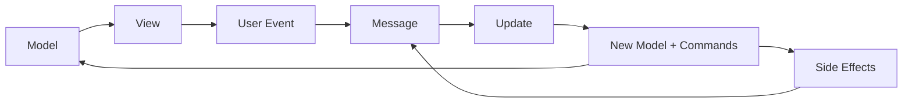

Foldkit is built on the Elm Architecture, a pattern that enforces predictable, testable application structure through unidirectional data flow. Every Foldkit application follows the same Model-Update-View cycle.

## Core Principles

The architecture is built on three foundational principles:

1. **Model as single source of truth** — All application state lives in one immutable data structure
2. **Messages as facts, not commands** — Events describe what happened, not what should happen
3. **Side effects confined to commands** — Impure operations return Effects that produce messages

## The Model-Update-View Cycle

<Steps>

### Model

Your application state is a single Schema-validated structure:

```typescript
import { Schema as S } from 'effect'

const Model = S.Struct({
  count: S.Number,
})
type Model = typeof Model.Type
```

### Message

User interactions and async results become messages:

```typescript
import { m } from 'foldkit/message'

const ClickedIncrement = m('ClickedIncrement')
const ClickedDecrement = m('ClickedDecrement')

const Message = S.Union(ClickedIncrement, ClickedDecrement)
type Message = typeof Message.Type
```

### Update

Messages transform the model and return commands:

```typescript
import { Match as M } from 'effect'
import { Command } from 'foldkit/command'

const update = (
  model: Model,
  message: Message,
): [Model, ReadonlyArray<Command<Message>>] =>
  M.value(message).pipe(
    M.withReturnType<[Model, ReadonlyArray<Command<Message>>]>(),
    M.tagsExhaustive({
      ClickedIncrement: () => [{ count: model.count + 1 }, []],
      ClickedDecrement: () => [{ count: model.count - 1 }, []],
    }),
  )
```

### View

The model is rendered into HTML:

```typescript
import { Html, html } from 'foldkit/html'

const { div, button, OnClick, Class } = html<Message>()

const view = (model: Model): Html =>
  div(
    [Class('flex flex-col items-center gap-4')],
    [
      div([Class('text-4xl')], [model.count.toString()]),
      button([OnClick(ClickedIncrement())], ['+']),
      button([OnClick(ClickedDecrement())], ['-']),
    ],
  )
```

</Steps>

## Data Flow

The cycle is strictly unidirectional:



1. The **view** renders the current **model**
2. User interactions create **messages**
3. **Update** receives the message and current model
4. Update returns a new model and commands
5. Commands run asynchronously and produce new messages
6. The cycle repeats

## Runtime Configuration

### Element (No Routing)

For components without URL routing:

```typescript
import { Runtime } from 'foldkit'

const element = Runtime.makeElement({
  Model,
  init: () => [{ count: 0 }, []],
  update,
  view,
  container: document.getElementById('root')!,
})

Runtime.run(element)
```

### Application (With Routing)

For full applications with browser navigation:

```typescript
import { Runtime } from 'foldkit'

const app = Runtime.makeApplication({
  Model,
  init: (url: Url) => {
    const route = parseRoute(url)
    return [{ route, data: null }, []]
  },
  update,
  view,
  container: document.getElementById('root')!,
  browser: {
    onUrlRequest: request => ClickedLink({ request }),
    onUrlChange: url => ChangedUrl({ url }),
  },
})

Runtime.run(app)
```

## Architecture Boundaries

<Warning>
Violating these boundaries breaks the architecture's guarantees:

- **Never mutate the model** — Return a new model from update
- **Never perform side effects in update** — Return commands instead
- **Never perform side effects in view** — Views are pure transformations
- **Messages are past-tense events** — Use `ClickedButton`, not `ClickButton`
</Warning>

## Why This Pattern?

The Elm Architecture provides:

- **Predictability** — Every state change is explicit and traceable
- **Testability** — Pure functions are trivial to test
- **Time-travel debugging** — State snapshots enable replay
- **Fearless refactoring** — Type safety catches breaks at compile time
- **Easy reasoning** — No hidden state, no action-at-a-distance

## Next Steps

<CardGroup cols={2}>
  <Card title="Model" icon="database" href="/concepts/model">
    Define your application state with Schema
  </Card>
  <Card title="Messages" icon="envelope" href="/concepts/messages">
    Create type-safe event constructors
  </Card>
  <Card title="Update" icon="arrows-rotate" href="/concepts/update">
    Handle messages and produce new state
  </Card>
  <Card title="View" icon="eye" href="/concepts/view">
    Render your model as HTML
  </Card>
</CardGroup>
